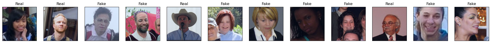
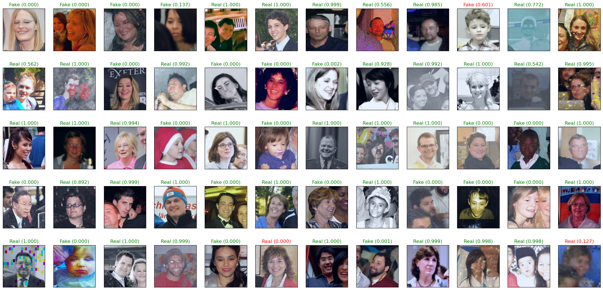
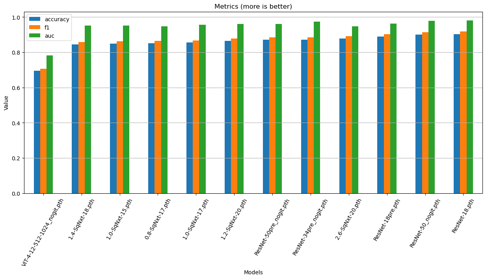

# Антидипфейк: Вызов 2025
## Проект

Конкурс международной олимпиады "IT-Планета 2025"
по разработке проектов, методов и
алгоритмов борьбы с дипфейками [ссылка][intensive]

### Описание

> Конкурс «Антидипфейк: Вызов 2025» нацелен на создание эффективных инструментов
> для борьбы с дипфейками — синтетическим контентом, который становится всё более
> опасным инструментом дезинформации. В эпоху цифровой трансформации,
> когда информация распространяется молниеносно, важно разработать технологии,
> защищающие общество от манипуляций и ложных сведений. Конкурс стимулирует
> инновационное мышление и привлечение талантливых специалистов к решению одной
> из самых актуальных проблем современности.

В проекте реализованы модели SqueezeNeXt, ResNet, Vit на
феймворке PyTorch (& torchvision). Обучены на датасете
из 190000 изображений.
Подробнее можно увидеть в файле `deep_fake.ipynb` 

### Пояснения

- `deep_fake.ipynb` - Jupyter Notebook с кодом проекта
- `deep_fake.html` - html версия для чтения проекта
- `conda.yaml` - зависимости проекта (Anaconda)
- `models/` - директория с обученными моделями
- `example/` - рабочая папка для изображений в рабочем режиме
- `img/` - графики и примеры

## Датасет
Датасет содержит 190К 256x256 изображений лиц,
реальные и сгенерированные лица.

[Датасет на Kaggle (1.8 GB)][dataset]

## Ссылки на ресурсы

Архитектура _ResNet_:

- [ResNet-1] - статья на huggingface

Архитектура _SqueezeNeXt_:

- [SqNext-1] - статья на Medium
- [SqNext-2] - пример реализации архитектуры на github
- [SqNext-3] - оригинальная статья на arxiv

Архитектура _ViT_:

- [ViT-1] - статья на huggingface
- [ViT-2] - оригинальная статья на arxiv

## Исходники

Другие ссылки где посмотреть исходники

| Source | Link                                                              |
|--------|-------------------------------------------------------------------|
| GitHub | [https://github.com/AndryMaster/ML_model_Deppfake_detection][git] |

## License
MIT

   [intensive]: <https://challenge.braim.org/landing/antideepfake_contest>
   [disk]: <https://disk.yandex.ru/d/PdQzdRuKim-lnQ>
   [dataset]: <https://www.kaggle.com/datasets/manjilkarki/deepfake-and-real-images/data?select=Dataset>
   [git]: <https://github.com/AndryMaster/ML_model_Deppfake_detection>
   
   [SqNext-1]: <https://sh-tsang.medium.com/reading-squeezenext-hardware-aware-neural-network-design-image-classification-3fc8d1d3f76>
   [SqNext-2]: <https://github.com/osmr/imgclsmob/blob/c03fa67de3c9e454e9b6d35fe9cbb6b15c28fda7/pytorch/pytorchcv/models/squeezenext.py>
   [SqNext-3]: <https://arxiv.org/abs/1803.10615>

   [ResNet-1]: <https://www.geeksforgeeks.org/residual-networks-resnet-deep-learning/>
   [ViT-1]: <https://huggingface.co/docs/transformers/model_doc/vit>
   [ViT-2]: <https://arxiv.org/pdf/2010.11929>
